When you use this program, please cite "H. Nomura and Y. Yamanishi", AIP Advances 14, 095204 (2024). 
https://pubs.aip.org/aip/adv/article/14/9/095204/3311286/OpenLabSPM-Bare-bone-package-of-LabVIEW-based

# Install

Please download the OpenLabSPM repository with the following URL.

[OpenLabSPM](https://github.com/HikaruNomura/OpenLabSPM.git)

or you can clone the repository by following command.

```cmd
git@github.com:HikaruNomura/OpenLabSPM.git
```


# Initial setup

First, start NI MAX. You will find the PXI chassis in "My System", "Devices and Interfaces". In this image it is NI PXIe-1083 "PXIChassis1". Also you can find the FPA inside the PXI chassis. In this image it is 2: NI PXIe-7856R "PXI1Slot". If you do not find the FPGA here, please recheck the connection to the PC. Also, the LabVIEW driver may not be properly installed. In this case, reinstall the LabVIEW RIO driver.

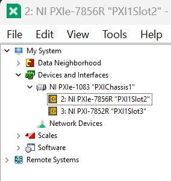

Check the name of the FPGA. We use this name in the project file. If the name is "PXI1Slot2", you can use it without changing the project file settings.

Please open the OpenLabSPM directory. You will find a LabVIEW project file (OpenLabSPM.lvproj). Please open OpenLabSPM.lvproj in LabVIEW.

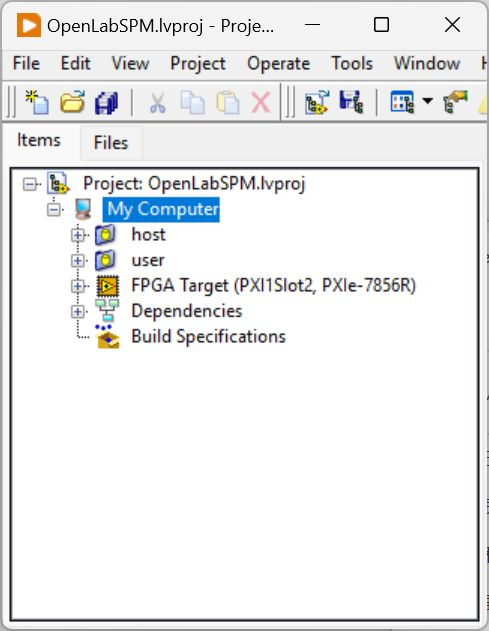

If the FPGA name is not "PXI1Slot2", open OpenLabSPM.lvproj. Right click on the FPGA Target and select RIO Device Setup. In the dialog box that pops up, select the FPGA you want to use.

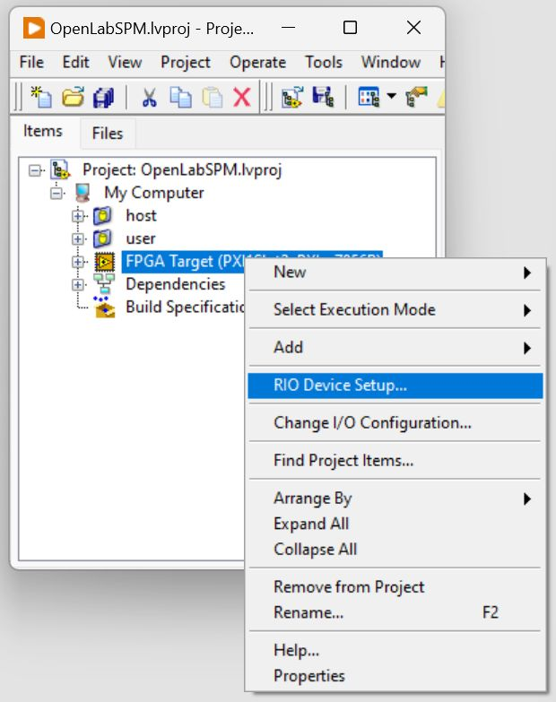

Right click on the FPGA Target and select Change I/O Configuration.

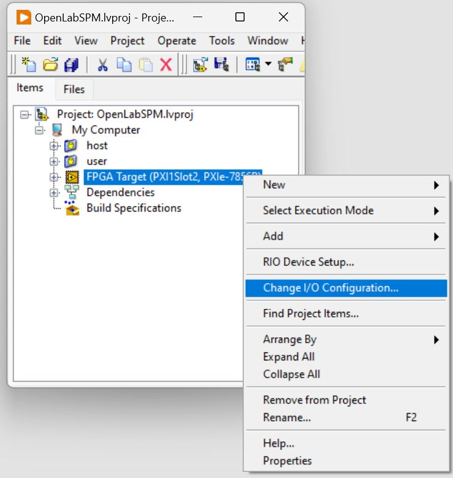

Make sure that the RIO settings are as follows,

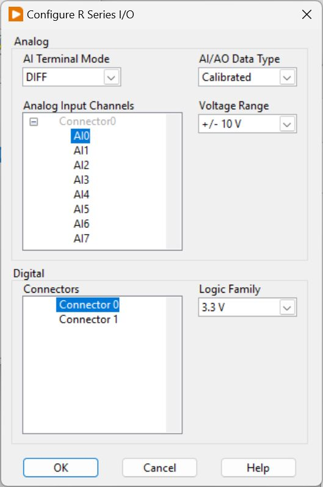

# Startup

To start, open main.vi in My Computer, host.

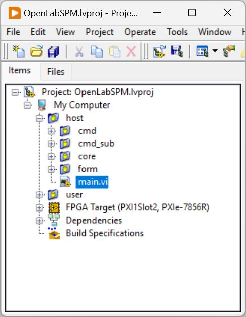

The main screen will pop up as shown below.

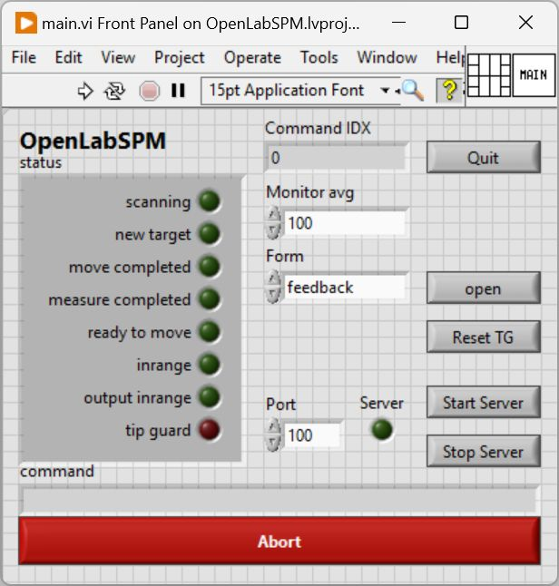

Please run the VI.

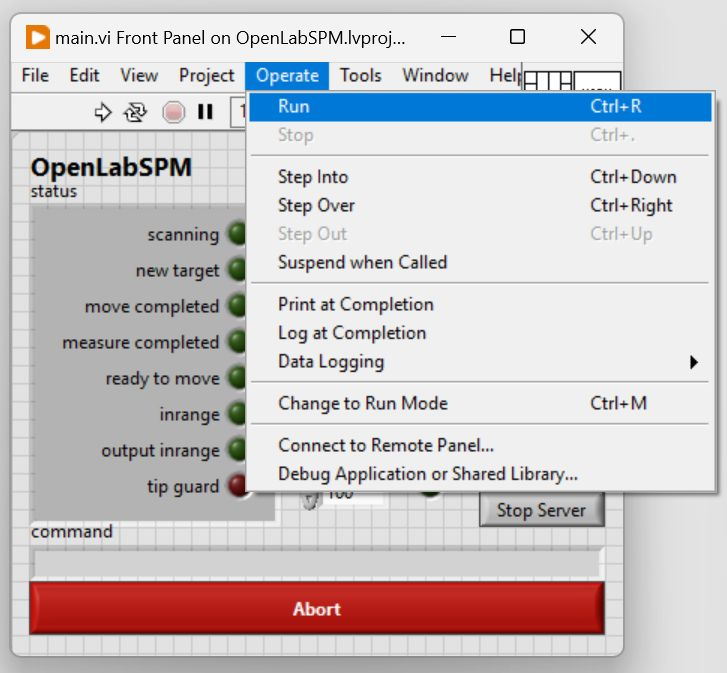

After executing VI, a pop-up will appear to select the directory where the experimental data will be stored. Select the directory of your choice. This directory will also store the command logs.

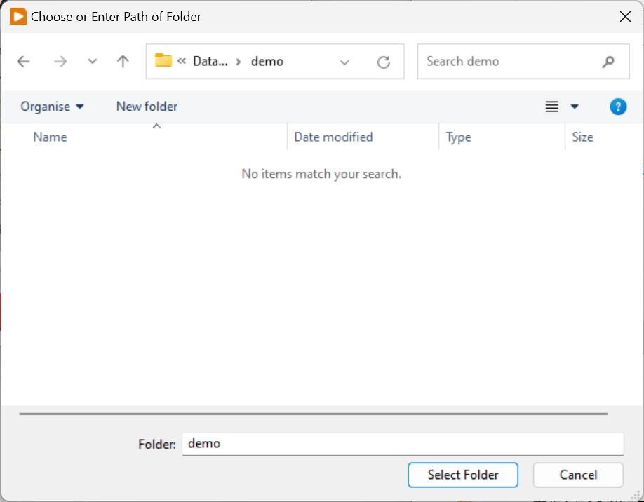

Now you can use SPM.

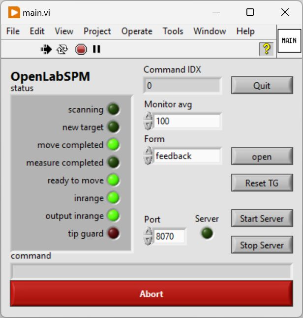

# Tutorial
Various forms can be opened by selecting the form you wish to open from the Form pull-down in the main window and pressing the open button.

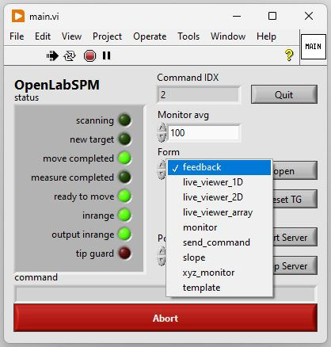

The pre-built form is shown below.

| Form Name | Descriptions |
|-|-|
| feedback | Controls feedback parameters. |
| live_viewer_1D | Displays scan data in a one-dimensional plot. |
| live_viewer_2D | Displays scan data in a image. |
| live_viewer_array | Displays scan data with data array. |
| monitor | Displays AI/AO/Feed real time back value in a one-dimensional plot. |
| send_command | Send command to the system. |
| slope | Controls slope compensation. |
| xyz_monitor | Displays x-y-z values in real time. |
| template | Show template form. |

This system works with text commands. Select send_command from the Form pull-down on the main screen and press the open button.
The following command input screen will open.

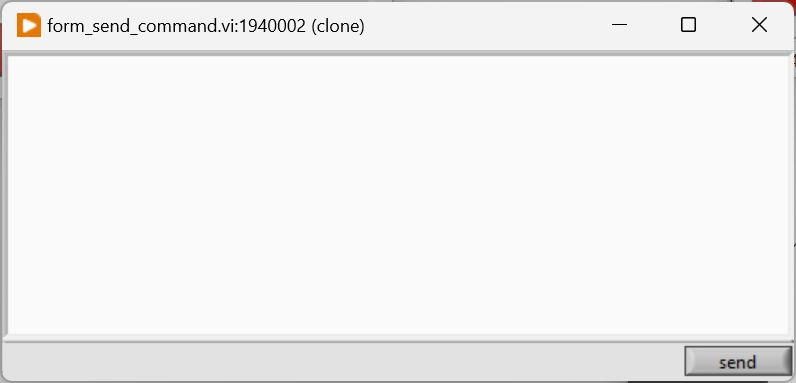

The available commands are stored in host/cmd. The command name is the vi name stored in host/cmd with the prefix of cmd_ removed. For example, cmd_quit.vi becomes quit. The command parameters are defined in the args cluster on the vi front panel.

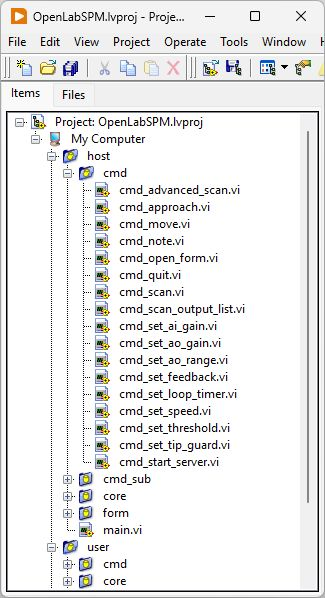

For example, in the case of the scan command, the parameters are nx and ny.

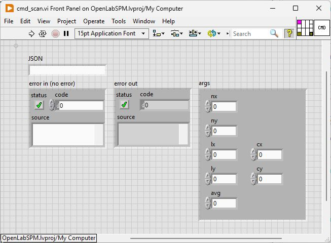

Descriptions of each parameter are provided in the context help.

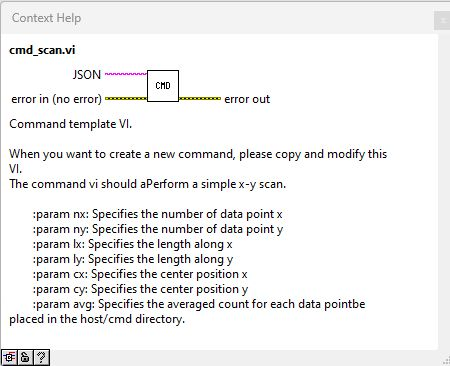

Open monitor, xyz_monitor, live_viewer_1D and live_viewer_2D and send_command forms.
Enter the following command and click send button in the send_command form.

```
{"cmd":"scan", "args":{"nx":128, "ny":128, "lx":5, "ly":5, "cx":0, "cy":0, "avg":100}}
```

With this command, an area of 5Vx5V centered on (0, 0) is scanned with 128x128 data points.
A screenshot during scanning is shown below. The channel you wish to view can be selected from the pull-down menu.

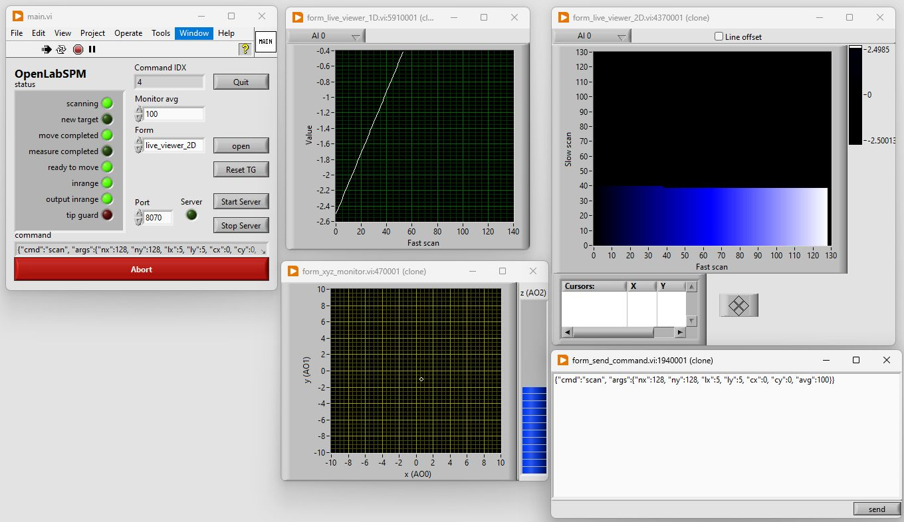

If initialize.txt is placed in the data storage directory, the commands listed will be automatically executed when the directory is selected. Please see [demo/initialize.txt](demo/initialize.txt).


A python wrapper is provided in the [python/OpenLabSPM.py](python/OpenLabSPM.py file.)
Function usage is described in the docstring for each function.
The python wrapper uses TCP/IP communication. To use it, press the start server button in the Main window.
An example program using python is shown below.

```python
import OpenLabSPM as spm

client = spm.Client()
client.scan(nx=128, ny=128, lx=5, ly=5, cx=0, cy=0, avg=100)
```

If you have any questions or request, please contact us (hikaru.nomura.d6@tohoku.ac.jp)

